# stepper
Stepper - Customizable Workflow/Pipeline System

Stepper is a customizable workflow/pipeline system that empowers users to assemble and execute different scenarios, known as flows, using reusable components called steps. This robust system facilitates the execution of flows, generates desired results, and provides valuable insights through information and statistics collection.

Key Features:

Workflow assembly: Define and configure the steps that compose your workflow.
Execution options: Run flows using various UI clients, including a simple CLI and a Desktop client.
User and permission management: Efficiently manage users and permissions within the system.
Concurrent client support: Serve multiple clients concurrently, ensuring smooth execution of flows.
Progress tracking: Collect comprehensive information and statistics on flow progress.
Technologies Used:

Java programming language
JSON serialization for data handling
Multithreading for improved performance
Upcoming Feature:

Client-server architecture: Enabling distributed flow execution across multiple systems.
Usage:
Stepper is designed to provide flexibility and adaptability, allowing you to create workflows and pipelines tailored to your specific needs. Follow these steps to get started:

Define the steps required for your workflow.
Assemble these steps into a flow that represents your desired workflow structure.
Execute the flow using the provided UI clients or programmatically.
Feel free to customize and enhance your workflows as per your unique requirements.

The Admin stepper application start to run
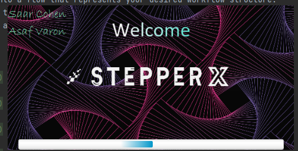

Here the Admin need to load xml file that contain details about the flows and the steps with more details (aliasing and initial inputs etc.)
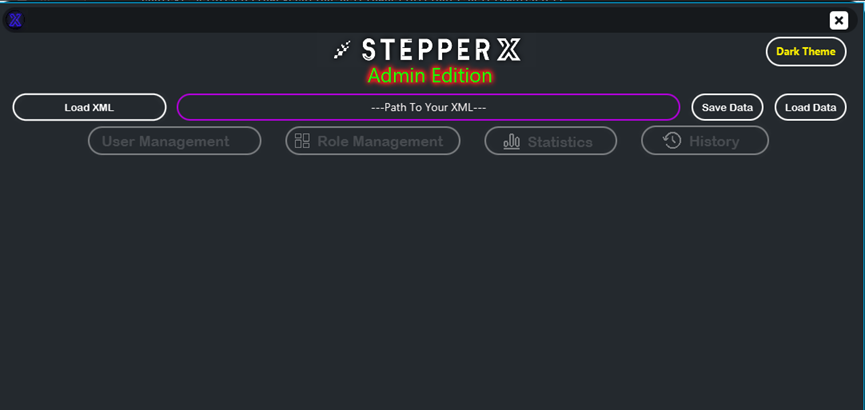

Screen that see the current user in the system (now it's empty)
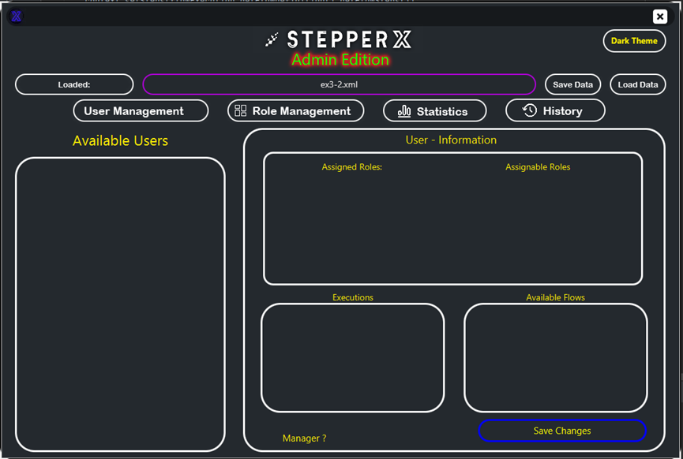

See the main screen in the Admin app the show the available flows
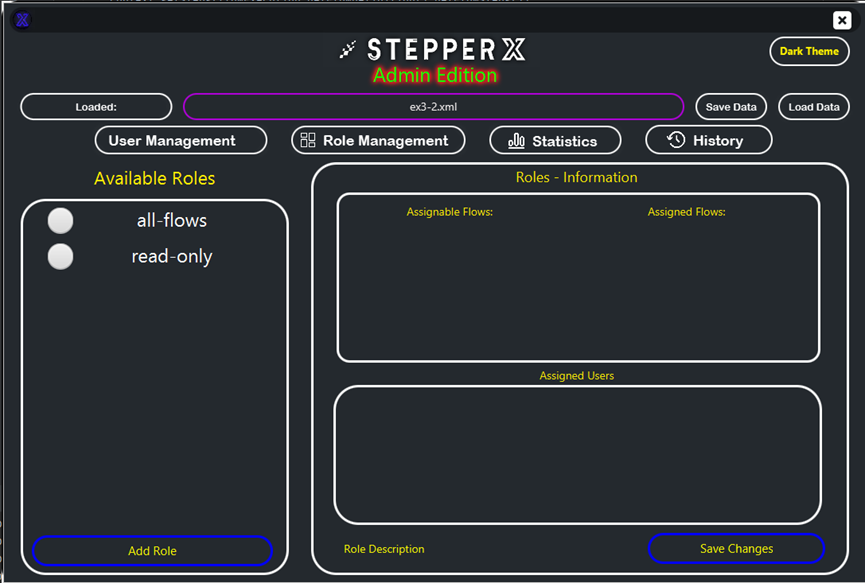

After the Admin load Xml with flows
we can see the flow that the Admin loaded in the Admin screen
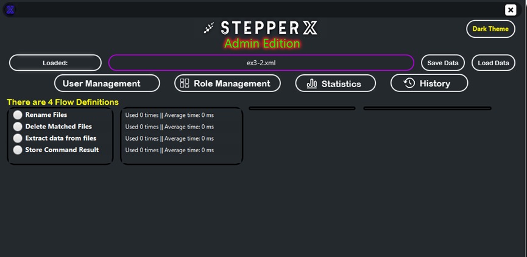

Admin statistics screen 
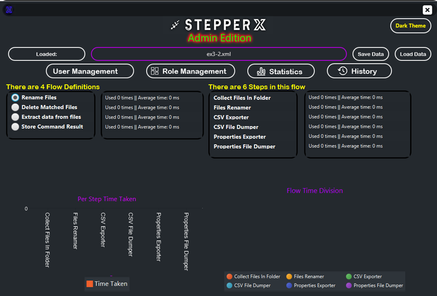

Admin history screen
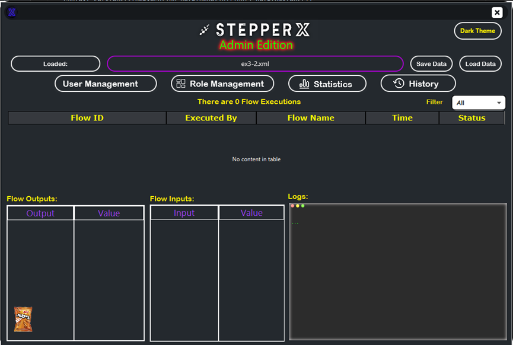

Client screen + press on the first flow to run
click on the execute button and move to the execute screen  
(we give the option to see more details about the flow)
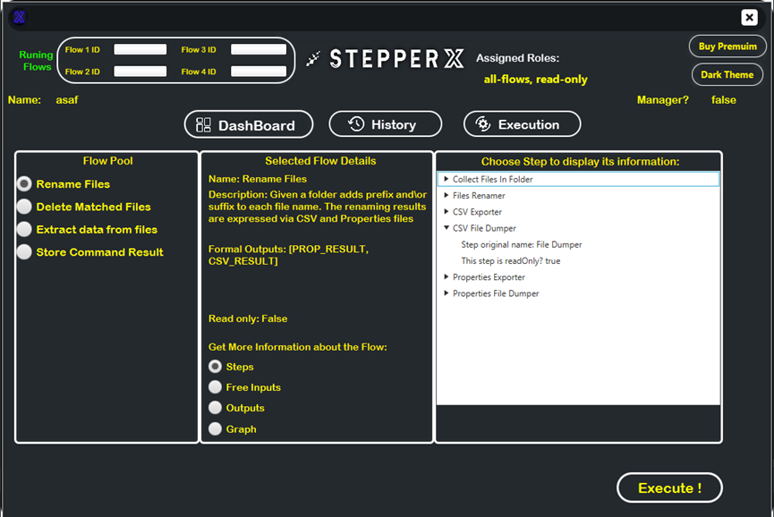

take the free input from the user (this is the input that the user must supply)
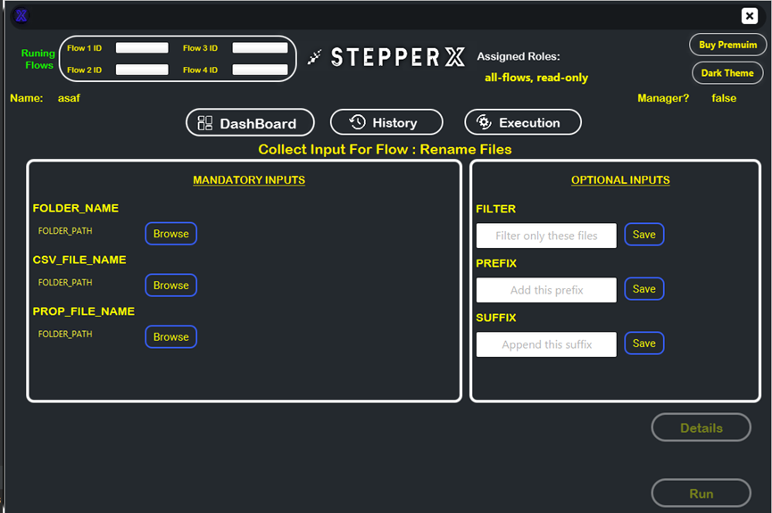

after execute the flow we get a pop-up of the end of the flow with details like logs and output of the flow and
details about the execution status
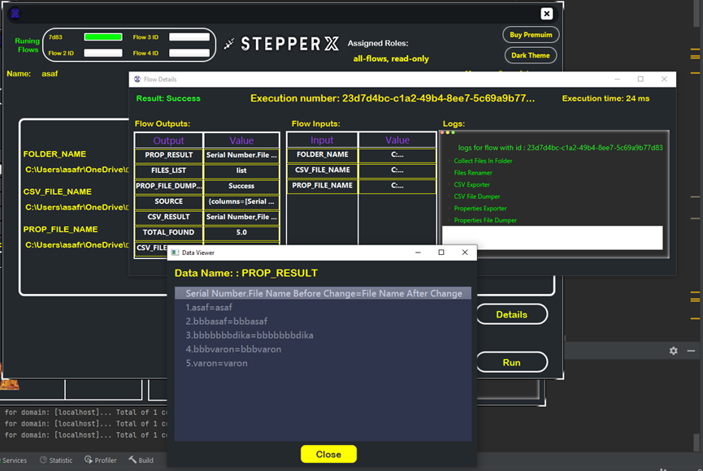

go to the history screen see details about the flow with the option to run in again without to supply the free inputs again
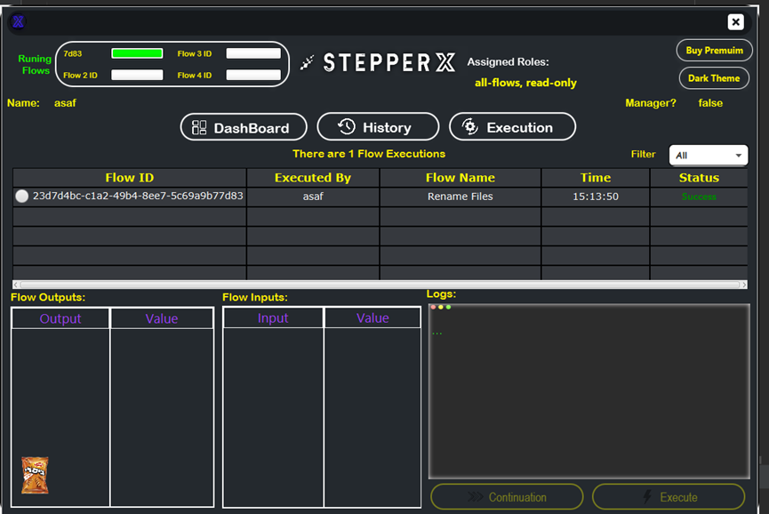

see statistics from the admin screen
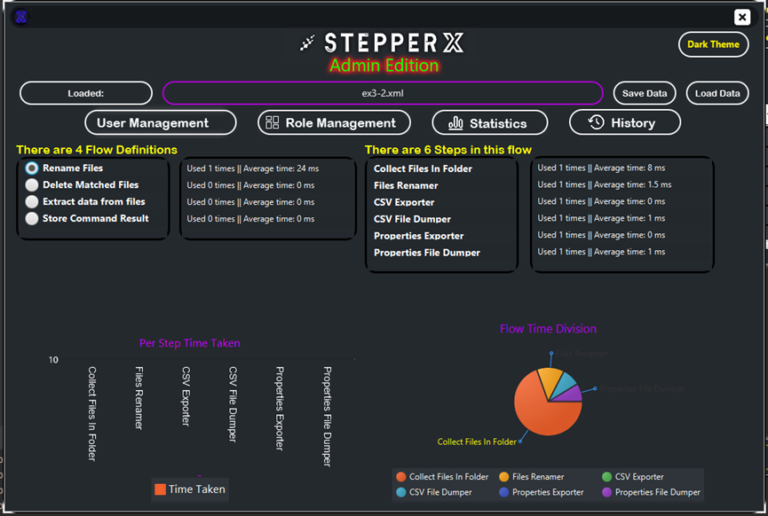

